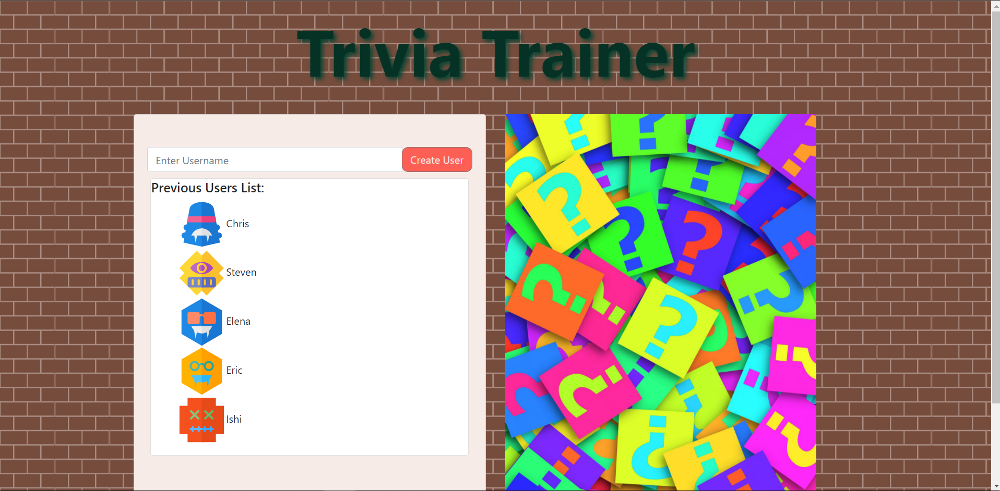
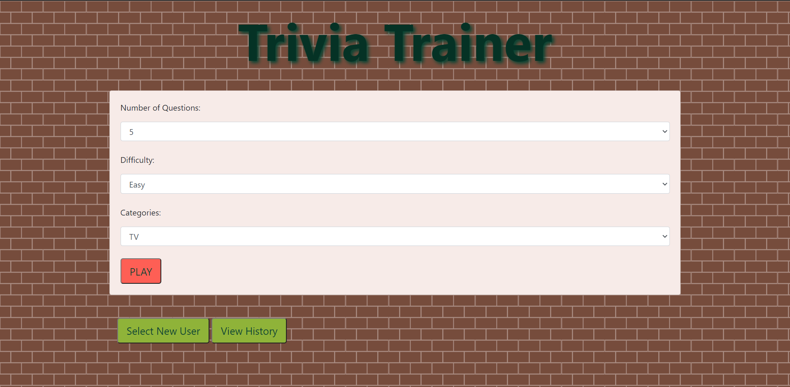
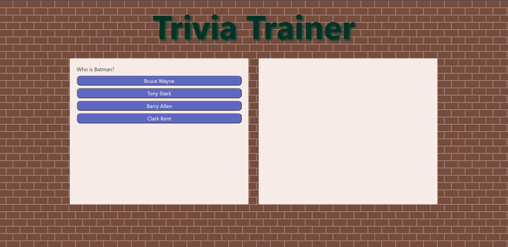
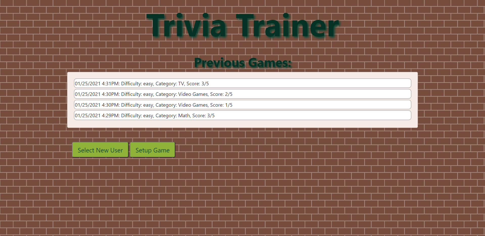

# Trivia Trainer

The trivia trainer is a website that allows you to train against several opponents to better yourself at trivia. It allows you to select your own username and choose several options, such as difficulty and category.

<a href = "https://malenchite.github.io/trivia-trainer/">Here is a link to the Trivia Trainer</a>

## Using The Trivia Trainer

To use the trivia trainer, either enter a new username and click the button, or select from a list of past users. After selecting the user, you will be taken automatically to the setup page. This will allow you to select any categories, amount of questions, and difficulty that you want. From here, you can view the past records of the user that have selected, or contiue onto the quiz. To take the quiz, just select the correct answer before the opponents do.

## Screenshots

  

## Contributors

Thank you to the following people that have contributed to this project:

-Steven Israel

-Elena Magay

-Eric Ellis

-Ishi Mustain

-Chris Risseler

## Credits

The following APIs were used in the creation of this project:

DiceBear Avatars

Open Trivia API

## License

This project uses the following license: MIT License Copyright(c) 2021
<a href = "assets/license.md">License Here.</a>
